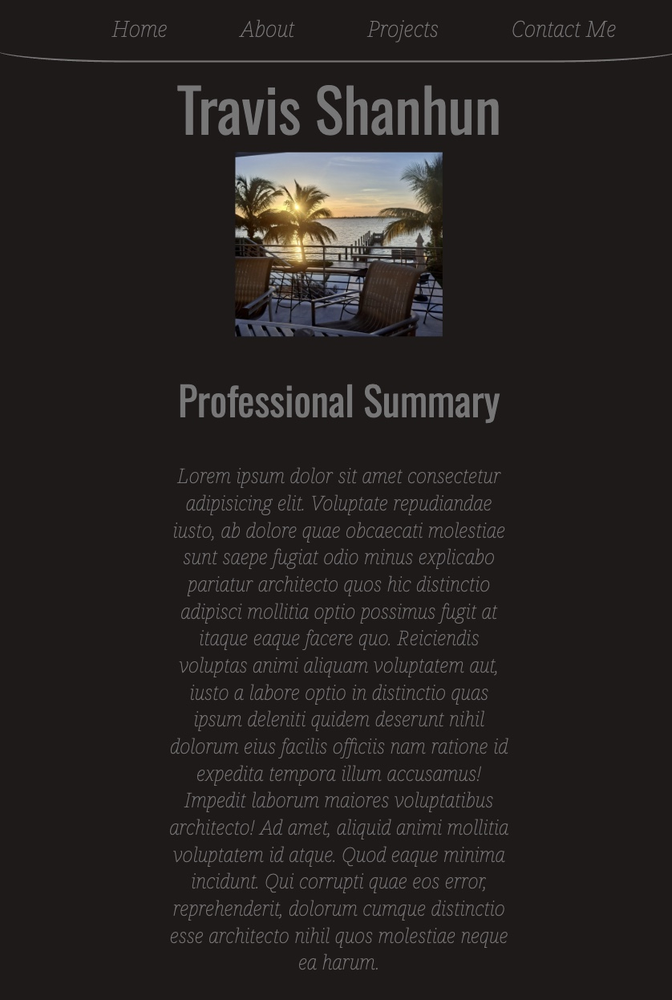

# Title:

Travis Shanhun - Professional Portfolio

## Table of Contents:

[Description](#description)

[User Information](#user-information)

[Questions](#questions)

[Link to live site](#link-to-live-site)

[Images Of website functionality](#images-of-webpage-functionality)

[License](#license)

## Description:

This application is a professional portfolio for potential employers to be able to visit, read about me, have access to my socials, find my resume, and finally be able to contact me directly from the webpage input.

## User Information

<a href='https://github.com/RaszeroT'> Travis Shanhun's github username: RaszeroT</a>

Email: shanhun.codes@gmail.com

## Questions

Please reach out to me if you have any further questions via:
Email: shanhun.codes@gmail.com

If you would like to view the code for this webpage please visit:
<a href='https://github.com/RaszeroT/professional-profile'>Professional Portfolio Repository</a>

## Link to live site:

<a href="https://raszerot.github.io/professional-profile/">Link to live site</a>

## Video Tutorial:

<a href=''>Coming Soon!</a>

## Images of webpage functionality:

 

## License

MIT License

Copyright (c) 2023 RaszeroT

Permission is hereby granted, free of charge, to any person obtaining a copy
of this software and associated documentation files (the "Software"), to deal
in the Software without restriction, including without limitation the rights
to use, copy, modify, merge, publish, distribute, sublicense, and/or sell
copies of the Software, and to permit persons to whom the Software is
furnished to do so, subject to the following conditions:

The above copyright notice and this permission notice shall be included in all
copies or substantial portions of the Software.

THE SOFTWARE IS PROVIDED "AS IS", WITHOUT WARRANTY OF ANY KIND, EXPRESS OR
IMPLIED, INCLUDING BUT NOT LIMITED TO THE WARRANTIES OF MERCHANTABILITY,
FITNESS FOR A PARTICULAR PURPOSE AND NONINFRINGEMENT. IN NO EVENT SHALL THE
AUTHORS OR COPYRIGHT HOLDERS BE LIABLE FOR ANY CLAIM, DAMAGES OR OTHER
LIABILITY, WHETHER IN AN ACTION OF CONTRACT, TORT OR OTHERWISE, ARISING FROM,
OUT OF OR IN CONNECTION WITH THE SOFTWARE OR THE USE OR OTHER DEALINGS IN THE
SOFTWARE.